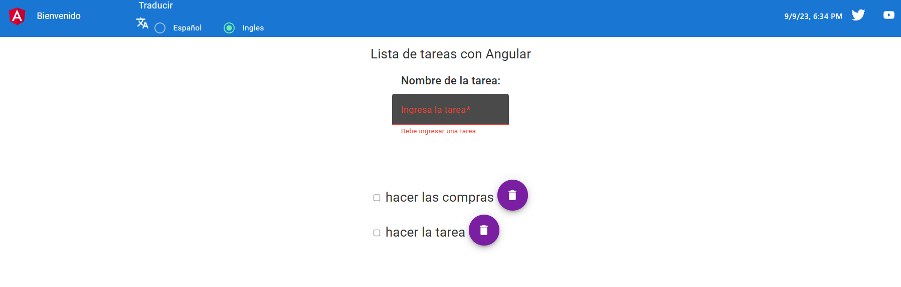

# ListaDeTareasAngular

Lista de tareas pendientes con Angular - Todo list

Es un proyecto de gestión de tareas pendientes con el framework Angular usando localStorage para el almacenamiento y TypeScript como lenguaje de programación y se usa la libreria transloco paratraducir la pagina web de español-ingles esta por default en idioma español tiene validacion para evitar mandar tareas vacias. 

# Instalación de la librería Transloco
-se usa esta libreria para las traducciones.

Realizamos la instalacion cpn la CLI de angular, ejecute el siguiente comando dentro de su proyecto Angular:

`ng add @ngneat/transloco` 

# Install Angular Material
-se usa esta librecia para los estilos

Use the Angular CLI's installation schematic to set up your Angular Material project by running the following command:

`ng add @angular/material`
 
# Indicaciones de como funciona el sitio web
1- se usa ng server para iniciar el CLI el programa.

2- se escoge el idioma deseado

3- se escribe una tarea  y se le click el boton guardar para almacenarla en la lista de tareas pendientes.

This project was generated with [Angular CLI](https://github.com/angular/angular-cli) version 16.2.1.

## Development server
*este comando es para hacer andar el programa
Run `ng serve` for a dev server. Navigate to `http://localhost:4200/`. The application will automatically reload if you change any of the source files.

## Code scaffolding
*esto es para instalar componentes standalone
Run `ng generate component component-name` to generate a new component. You can also use `ng generate directive|pipe|service|class|guard|interface|enum|module`.

## Build

Run `ng build` to build the project. The build artifacts will be stored in the `dist/` directory.

## Running unit tests

Run `ng test` to execute the unit tests via [Karma](https://karma-runner.github.io).

## Running end-to-end tests

Run `ng e2e` to execute the end-to-end tests via a platform of your choice. To use this command, you need to first add a package that implements end-to-end testing capabilities.

## Further help

To get more help on the Angular CLI use `ng help` or go check out the [Angular CLI Overview and Command Reference](https://angular.io/cli) page.
